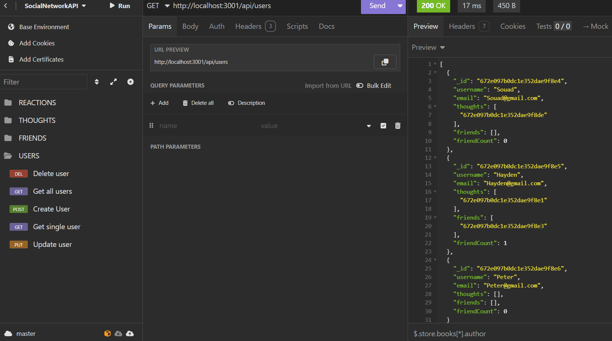
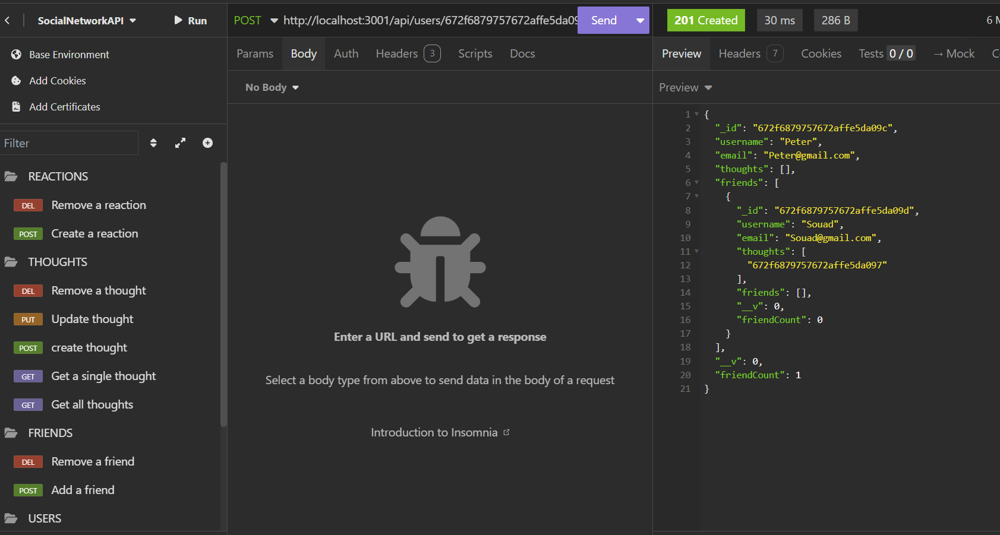
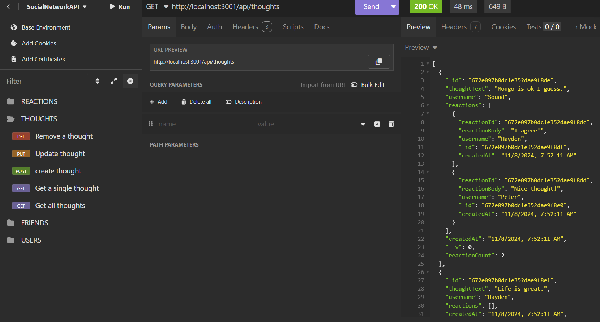
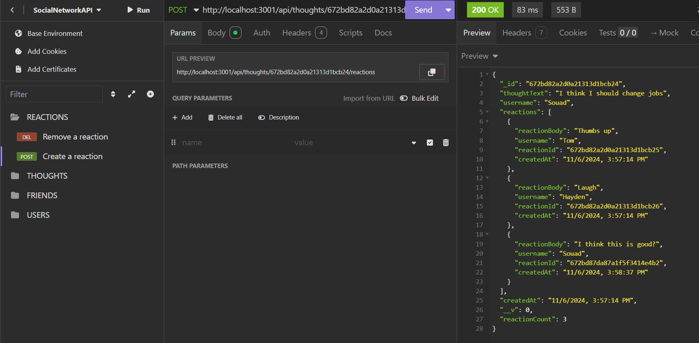

# **Social Network API**


---

# Table of Contents

- [**Project Description**](#project-description)
- [**Screenshots**](#screenshots)
- [**Technologies Used**](#technologies-used)
- [**Setup and Installation**](#setup-and-installation)
- [**Demonstration**](#demonstration)
- [**Questions**](#questions)
- [**License**](#license)

---

## **Project Description**

**Social Network API** is where users get to share their thoughts, react to friends' thoughts, and create a friend list.
Users data can be updated, created, or deleted. same goes for their thoughts.
In this application, Express.js was used for routing, MongoDB for the database, and Mongoose was used as an ODM.

---

## **Screenshots**

- **Users**:
  

- **Friends**:
  

- **Thoughts**:
  

- **Reactions**:
  

---

## **Technologies Used**

- **Backend**: Node.js, Express.js
- **Database**: MongoDB, Mongoose package
- **Version Control**: GitHub

---

## **Setup and Installation**

Follow these steps to get the application running on your local machine:

1. **Clone the Repository**

   ```bash
   git clone <repository-url>
   cd social-network-api
   ```

2. **Install Dependencies**

   ```bash
   npm install
   ```

3. **Run the Application**

   this demo is already seeded on start!

   ```bash
   npm run start
   ```

4. **Access the App**

   All routes on insomnia are accessible through: `http://localhost:3001`.

5. **Load the insomnia json file**

   Get the insomnia json file from assets/ folder and test the different endpoints!

---

## **Demonstration**

Click on this [Link](https://www.loom.com/share/80f96782851c4b91a1923992a29ef65d) to see the demo for this app!

## **Questions**

For any questions please reach out by email, and feel free to check my github:

<table>
  <tr>
    <td align="center">
      <a href="https://github.com/souad-hb">
        
        <br />
        <sub><b>Souad</b></sub>
      </a>
      <br />
      <a href="mailto:souadsalahh@gmail.com">souadsalahh@gmail.com</a>
    </td>
  </tr>
</table>

---

## **License**

This project is licensed under the [MIT License](https://opensource.org/licenses/MIT).
